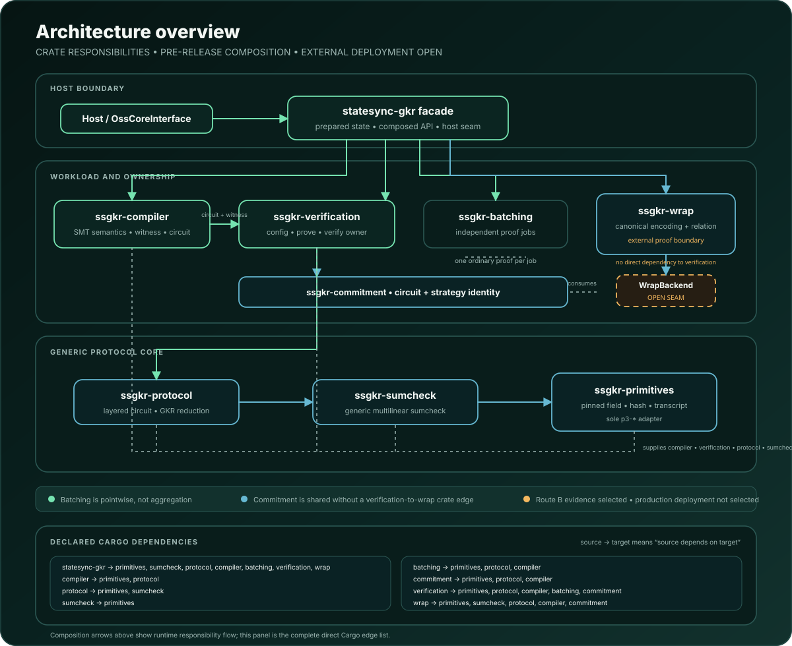
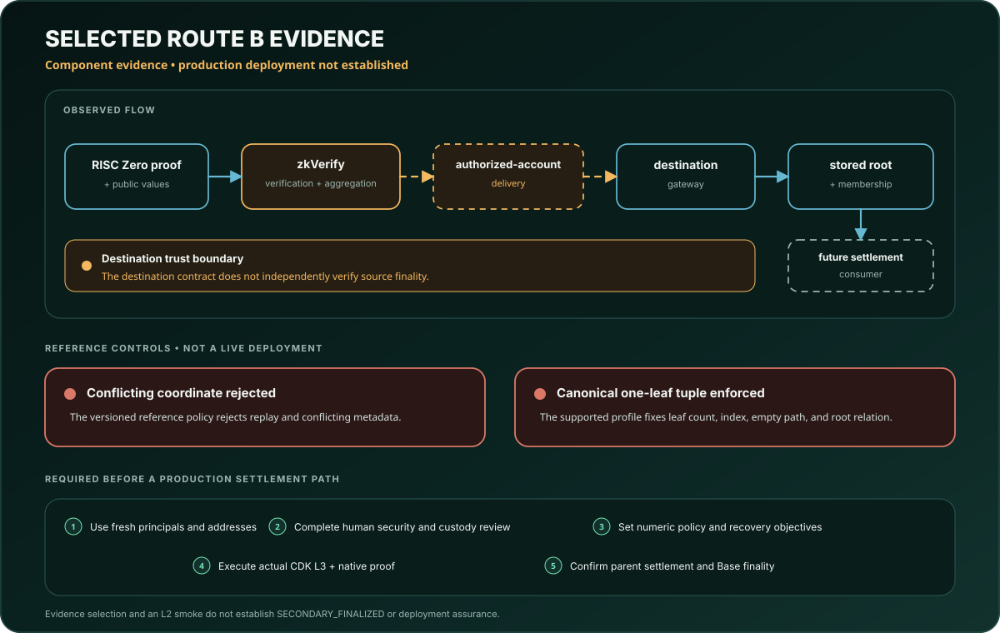

# Architecture

<p align="center">
  <picture>
    <source media="(max-width: 900px)" srcset="assets/diagrams/architecture-overview-mobile.svg">
    
  </picture>
</p>

## Component boundary

StateSync-GKR is a proof component, not a chain or production service. It owns
the state-transition relation, circuit compilation, GKR proof path, primary
record, selected zkVM identity, public encodings, and a receipt-gated reference
transition.

It does not own identity providers, source-network governance, receipt-network
operation, production signing custody, a deployed destination contract, native
rollup proving, parent-chain settlement, or secondary finality.

## Crate ownership

```text
ssgkr-primitives
       |
       v
ssgkr-sumcheck
       |
       v
ssgkr-protocol
       |
       v
ssgkr-compiler
       |
       +------------------+
       v                  v
ssgkr-batching     ssgkr-commitment
       \                  /
        +--------+--------+
                 v
       ssgkr-verification
                 |
                 v
          statesync-gkr facade
                 ^
                 |
           ssgkr-wrap
```

Arrows point from a crate to the crates that depend on it. `ssgkr-wrap` sits
beside `ssgkr-verification` rather than above it: it depends on primitives,
sumcheck, protocol, compiler, and commitment, and the two meet only at the
facade. Neither one depends on the other.

The generic protocol crates do not depend on the sparse-Merkle compiler.
Primitive field and hash ownership remains below both. Verification owns the
composed host request/result types. The wrap crate owns external proof,
manifest, receipt, and local transition encodings.

## State-to-proof path

1. Native sparse-Merkle semantics define valid membership, non-membership, and
   single-leaf update operations.
2. The compiler produces a layered arithmetic circuit and witness layout.
3. Circuit evaluation provides an independent executable oracle for tests.
4. Sumcheck reduces each layer claim.
5. The GKR verifier checks the reduction to the input-layer claim.
6. The transcript binds a domain tag, circuit digest, public inputs, layer
   claims, and round messages in a fixed order.
7. The facade emits a primary record and proof result.

The model and implementation relationship is scoped. Isabelle owns the
mathematical semantics and composition results. Rust tests and bounded
contracts connect selected implementation seams. Trusted functions, foreign
libraries, hash assumptions, and unsupported tool surfaces remain explicit.

## Finality vocabulary

Two finalities appear throughout this repository and they are not the same
thing.

**Primary finality** is finality in the source domain. A transition is
primary-final when a D-quencer quorum has certified it, which the record
carries as the state `Committed`; the state `Prepared` means the transition
exists but is not yet primary-final. Settlement requires `Committed`.

A **primary-finality record** is the canonical signed core of one such
transition, `PrimaryFinalityRecordV1` in `crates/wrap/src/settlement.rs`. It
fixes a route-independent transition identity, the route used for this
delivery attempt, the full SHA-256 commitment to the raw statement, the
preclaim binding, the source domain, the intended destination and action kind,
the checkpoint, the session and context identities, the accepted application
root, the state, the signer-set epoch, the issuance height, and the predecessor
it supersedes if it corrects one. Those fields hash under a domain tag into the
record ID that the external verifier signs over, so changing any of them is a
different record.

What this repository establishes about such a record is narrow. It owns the
canonical field set, the record ID, and the seam. It does **not** verify a
quorum: `PrimaryFinalityVerifier` is a trait, and a production implementation
has to check the signer-set epoch, duplicate signers, the quorum threshold,
and every signature over the exact record ID. A record that this repository
has not seen a valid certificate for is data, not a finalized fact.

**Secondary finality** is finality on the destination chain. This repository
does not claim it anywhere. A checked authorization result is evidence for a
future consumer; it mutates no application state and declares no secondary
finality. Signing a primary record also carries no receipt-root authority: the
two roles have independent epochs, as
[ADR-0005](docs/adr/0005-destination-receipt-enforcement.md) records.

## External proof and receipt path

```text
primary record
      |
      v
fixed zkVM program identity
      |
      v
public-verifiable proof
      |
      v
external receipt
      |
      v
authenticated local candidate transition
```

Each arrow crosses a distinct trust boundary.

- The zkVM proof is valid only for the fixed program identity and statement.
- The receipt path has its own domain, root, and authentication rules.
- Delivery does not prove source-network consensus inside the destination.
- The local candidate transition checks route, receipt, predecessor, replay,
  and conflict conditions.
- A local candidate is not a transaction and does not create secondary
  finality.

See [ADR-0002](docs/adr/0002-external-proof-role-contract.md).

## Frozen interfaces

The proof identity of the current release line freezes six compatibility
surfaces:

- dependency direction;
- sumcheck interface and message order;
- layered-circuit shape and semantics;
- native-semantics/circuit-acceptance boundary;
- transcript observation order and domain tag; and
- public-input field set and order.

The public names S-1 through S-6 and their non-claims are defined in
[docs/frozen-source-identifiers.md](docs/frozen-source-identifiers.md).
Changing any protected byte creates a different candidate identity. Expected
hashes are comparison targets, never update-on-build outputs.

## Batching

Batching groups independent jobs that share a compiled circuit. Each job keeps
its own witness, transcript, and proof. Sequential and parallel paths are
checked for pointwise agreement.

The component does not claim a single aggregate proof, shared mutable
cross-job proof state, scheduler liveness, or a controlled-hardware performance
result.

## Prepared material

Prepared material contains one exact circuit-and-hints profile. The decoder
checks bounds, reconstructs derived wiring locally, recomputes commitments, and
rejects trailing or non-canonical bytes. Derived wiring is recomputed locally and never trusted from the serialized
input.

This is a codec and binding profile, not route activation, deployment
authorization, or universal profile support.

## Trust boundaries

<p align="center">
  <picture>
    <source media="(max-width: 900px)" srcset="assets/diagrams/trust-boundary-mobile.svg">
    
  </picture>
</p>

| Boundary | Trusted or assumed | Checked here | Outside the claim |
|---|---|---|---|
| Field and hash | Pinned implementations and explicit black-box assumptions | Interface shape, domain separation, deterministic vectors | Cryptanalytic security and side channels |
| Compiler | Native meaning standard and reviewed layout | Differential/adversarial tests and model results | Unsupported operations and whole-program refinement |
| GKR | Fiat-Shamir model, field arithmetic, fixed circuit commitment | Model theorems, verifier tests, proof-digest equality | Arbitrary circuits and malicious external libraries |
| zkVM | Fixed program identity and verifier version | Saved-proof verification and exact hashes | Operator confidentiality and future verifier behavior |
| Receipt | Fixed statement, domain, root, and path | Codec equality and receipt checks | Receipt-network governance |
| Destination | Immutable policy inputs and reference state | Replay, conflict, predecessor, and local-candidate behavior | Production code, roles, custody, monitoring, and finality |

## Failure model

Malformed input, unsupported versions, mismatched identity, wrong statement,
wrong receipt, replay, conflict, and predecessor mismatch fail closed. An
external dependency being unavailable does not become a success.

Availability, timing, resource exhaustion, operational recovery time, and
production incident response require separate evidence.

## Source layout

- Rust source: `src/` and `crates/`
- Isabelle source: `formal/isabelle/`
- Replay metadata: `verif/`
- Public vectors: `tests/vectors/`
- Selected zkVM integration: `spikes/zkvm-wrap/`
- Release verifier and manifests: `release/v1.1/`
