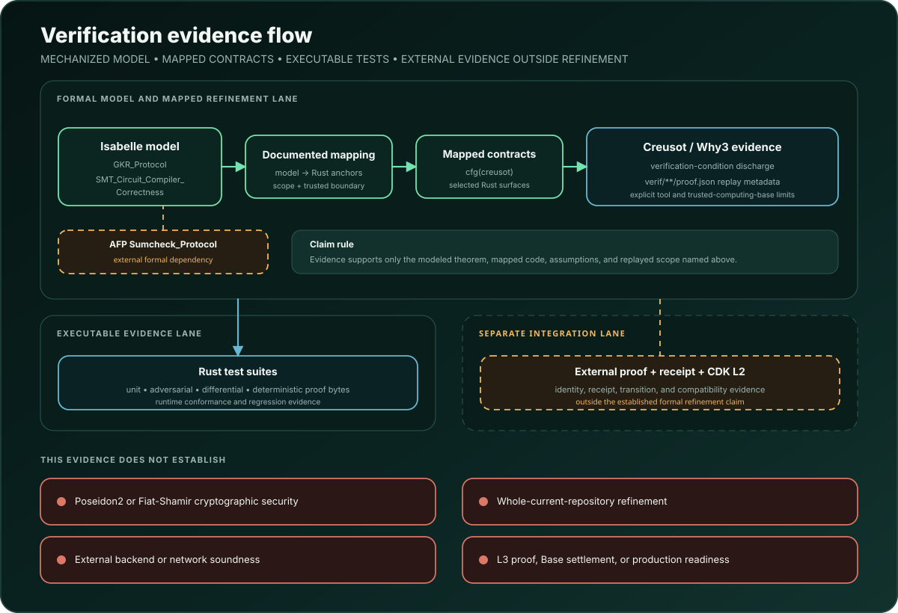

# Formal verification

Version 1.1.1 is a BSL distribution and package-metadata revision. The Rust
kernel and formal sources retain their recorded contents. The root Cargo
license field is the sole change in the identity-source selection. The
[licensing distribution record](release/v1.1/LICENSING_DISTRIBUTION.json)
separates that source comparison from the historical v1.1 executable and
proof. The current metadata revision has not completed an exact compiled
identity reproduction; the historical proof is evidence of its recorded
program only.

<p align="center">
  <picture>
    <source media="(max-width: 900px)" srcset="assets/diagrams/verification-flow-mobile.svg">
    
  </picture>
</p>

## What is mechanized

StateSync-GKR contains six registered Isabelle sessions:

- `GKR_Protocol` models multilinear extensions, sumcheck, layered circuits,
  wiring predicates, GKR assembly, the forward refinement from a successful
  verifier acceptance trace to the assembly's reduction-chain event, and
  independent-job batching.
- `SMT_Circuit_Compiler_Correctness` models sparse-Merkle operation
  semantics, leaf folding, compiler layout, compiler correctness, concrete
  instances, and composition with the GKR session.
- `KoalaBear_Ext4_Nonsquare`, `KoalaBear_Ext4_Field`, `KoalaBear_Ext4_Lift`, and
  `KoalaBear_Ext4_GKR` transfer the GKR soundness chain from the KoalaBear
  base field to the exact degree-four extension field used for verifier
  challenges: nonsquare certificates, the quartic field instance with
  cardinality `p^4` and the base-field embedding, polynomial,
  multilinear-extension, and circuit lifting, and the exact-field GKR
  soundness instance with a conditional uniform-coefficient pushforward.

The canonical theory sources live under `formal/isabelle/`. The generated
PDFs under `docs/` are base-session documentation snapshots from 2026-08-29.
The current extension-field chain and verifier acceptance refinement are
documented in the theory sources and this file; those PDFs do not include
these later results.

## Public theorem families

The public theorem names are stable identifiers documented in
[docs/frozen-source-identifiers.md](docs/frozen-source-identifiers.md).

### Theorem A

Compiled-circuit acceptance agrees with sparse-Merkle operation semantics, in both directions and for all three operations.

- **Named theorems:** `theorem_A_soundness`, `theorem_A_completeness`
- **Canonical source:** `SMT_Semantics.thy`, `Compiler_Model.thy`, `Compiler_Correctness.thy`

### Theorem B

Against an arbitrary prover, a false claimed output survives the sumcheck and wiring reduction chain only with the proved probability bound.

- **Named theorems:** `gkr_assembly_soundness`
- **Canonical source:** `Sumcheck_Instance.thy`, `Wiring_MLE.thy`, `Layer_Representative.thy`, `GKR_Assembly.thy`

### Theorem C

The compiler and GKR results compose into one bound on the state-to-proof path for the named verification model.

- **Named theorems:** composition results in `Composition.thy`
- **Canonical source:** `Composition.thy`, `Compiler_Instance.thy`, `Composition_Instance.thy`

### Theorem D

Independent-job batch results agree pointwise with their single-job counterparts, preserving acceptance and rejection.

- **Named theorems:** `theorem_D_batching_correctness`, `theorem_D_accept_preservation`, `theorem_D_reject_preservation`
- **Canonical source:** `GKR_Batching.thy`

### Verifier acceptance refinement

A successful acceptance trace of the shipped Rust verifier inhabits the reduction-chain event of Theorem B, given an explicit relation between the Rust trace values and the model. That relation is a stated premise and is not discharged against the compiled program, so the result is a conditional refinement. The reverse direction is a stated non-claim.

- **Named theorems:** `production_verifier_acceptance_refines_gkr_chain_bad`, `verifier_acceptance_implies_gkr_chain_bad`, `gkr_chain_bad_does_not_imply_public_input_acceptance`
- **Canonical source:** `Verifier_Acceptance_Refinement.thy`

### Extension-field transfer

Theorem B holds over the exact degree-four extension of KoalaBear, the denominator of its bound is exactly `p^4`, and four independent uniform base-field coefficients push forward to a uniform extension element. The executable challenge derivation is not part of the statement.

- **Named theorems:** `gkr_assembly_soundness_ext4`, `ext4_denominator_exact`, `uniform_coeff_tuple_pushforward`
- **Canonical source:** `KoalaBear_Ext4_Nonsquare.thy`, `KoalaBear_Ext4_Field.thy`, `KoalaBear_Ext4_Lift.thy`, `KoalaBear_Ext4_GKR.thy`

These are model results under explicit assumptions. They are not claims of
whole-repository refinement, cryptographic security, deployment correctness,
or production safety.

## Rust/model refinement scopes

### R1

**Implementation surface:** Sparse-Merkle semantics, compiler, witness layout, and selected primitive anchors

**Evidence and boundary:** Bounded contracts, differential tests, and compiler theories; not every function is verified.

### R2

**Implementation surface:** Sumcheck, multilinear extensions, wiring, and layer reduction

**Evidence and boundary:** Bounded contracts and GKR theories. The whole-function translation opt-outs of the sumcheck and per-layer verifier bodies were narrowed to the single foreign-field equality each one needs, so round counting, degree checks, rejection, transcript order, carry construction, and the final claim are translated as ordinary code. Foreign traits and unsupported tool surfaces remain explicit.

### R3

**Implementation surface:** Configuration, composed verification owner, and public facade

**Evidence and boundary:** Named request/result and prove/verify seams. The public-input binding helper carries an exact equality contract, and an acceptance trace populated from the actual public-input, request-guard, zero-output, protocol-result, and final input-MLE observations is compiled on the test and translation configurations. Two source-bound and task-bound type-invariant leaves remain open and carry no claim. Not whole-repository refinement.

### R4

**Implementation surface:** Field, hash, foreign-constant, and opaque interface boundaries

**Evidence and boundary:** Assumption and interface records; no proof of underlying cryptographic security.

R2-1 is the leaf-tag domain-separation obligation: the first leaf-preimage
field remains the encoding tag in the compiler and primitive hash paths.

## Trusted and assumed boundaries

The formal evidence depends on:

- Isabelle/HOL and its code/document generation;
- the pinned Rust compiler and package graph;
- the Creusot/Why3 translation and trusted annotations recorded in source;
- field and hash implementations behind explicit abstract seams;
- an idealized challenge process for the whole interaction: once the
  transcript content so far is fixed, each four-coefficient tuple the
  challenger returns is jointly uniform over the base field and independent
  of every earlier tuple. The conditional coefficient pushforward then
  yields the uniform, independent extension-field challenges the model
  draws. This is a statement about the complete multi-round sequence, not
  about one sample, and it is not established for the executable
  transcript;
- for any implementation-facing reading of the bound, a Fiat-Shamir
  reduction for this multi-round protocol, with its query- and
  round-dependent loss, covering the exact duplex absorb-and-squeeze
  convention, the fixed message grammar, and the concrete Poseidon2
  permutation shared with the hash and the circuit commitment. The
  interactive bound does not transfer unchanged, and no such reduction is
  part of this repository;
- correspondence between the model's fixed circuit-input values and the
  input vector the verifier derives from the submitted witness. The
  transcript absorbs the public inputs and the circuit commitment, not the
  witness-derived input vector, so an implementation-facing argument must
  either bind that input before the challenges are drawn or account for
  every witness the adversary tries;
- correspondence between the modeled circuit and the selected Rust paths;
- the relation between the Rust trace values, the final running claim, the
  wiring right-hand side, the off-cube polynomial representation and the
  model, which the verifier acceptance refinement carries as a premise and
  which is not discharged; and
- the fixed protected source identity for the published zkVM proof.

A trusted annotation can make a function available to surrounding reasoning; it
is not evidence that the function body was proved. Replay metadata is not a
substitute for checking the named source, assumptions, and tool output.

The exact `p^4` denominator belongs to the model bound, whose numerator and
representation premises still apply. It is not an established error
probability or bit-security level for the executable Fiat-Shamir verifier.
[docs/challenge-generation-review.md](docs/challenge-generation-review.md)
records the reviewed source-to-model path, the transcript schedule, and the
conditions above.

## Building the Isabelle sessions

The sessions require **Isabelle2025-2** and a local checkout of the Archive
of Formal Proofs containing the `Sumcheck_Protocol` entry, which
`GKR_Protocol` extends. Point `isabelle build` at both trees:

```sh
isabelle build -d /path/to/afp/thys -d formal/isabelle \
  SMT_Circuit_Compiler_Correctness
```

`SMT_Circuit_Compiler_Correctness` depends on `GKR_Protocol`, so this single
command builds both sessions. Each session declares a 7200-second timeout; a
first build on a laptop is a long-running job, not a hang. See
[`formal/isabelle/README.md`](formal/isabelle/README.md) for the session
layout and the canonical-source boundary.

The extension-field sessions form a chain on top of it. Building the last
one builds all four:

```sh
isabelle build -d /path/to/afp/thys -d formal/isabelle \
  KoalaBear_Ext4_GKR
```

The hosted Proofs lane rebuilds every registered session from clean targets
when a pull request changes a proof input, on every push to the maintained
branch, and weekly. A session that does not complete fails the lane, and the
aggregate job fails when a skip is not justified by the gate that decides
whether a proof input changed, so a green result cannot come from a silently
omitted session.

The pinned Isabelle2025-2 build rejects `sorry` with the default
`quick_and_dirty=false`, as its release notes specify. Direct source scans
provide an additional check for admitted or abandoned proofs. The Proofs
workflow does not rebuild Isabelle sessions on release events; the separate
source-identity workflow checks the released source and proof attachment.
Treat the Proofs lane as the standing theorem check on the maintained branch.

## Rust checks

```sh
cargo fmt --all --check
cargo clippy --workspace --all-targets --locked -- -D warnings
cargo test --workspace --release --locked
cargo run --release --locked --bin proof_digest
```

The Rust suites include positive, negative, differential, adversarial, codec,
and deterministic proof-digest checks. Passing tests do not prove the absence
of untested defects.

## External proof and destination boundary

The selected zkVM program identity and public proof are implementation
artifacts, not Isabelle theorems. Receipt observation, delivery, an
EVM-compatible reference seam, and local candidate-transition tests are
integration evidence.

This repository does not prove receipt-network governance, source-network
consensus inside a destination, deployed bytecode, production custody,
operational recovery, native rollup proving, parent settlement, or secondary
finality.

It also does not establish compiled-Rust semantics, Fiat-Shamir soundness,
private wiring representation correctness, whole-program refinement, or the
converse of the verifier acceptance refinement. The model event does not
mention the request and public-input guards, so an inhabited model event
cannot authorize an executable acceptance whose public-input binding fails.

## Change discipline

A change to a theory, mapped Rust symbol, contract, theorem status,
protected byte, or trusted boundary must update this document and the relevant
machine-readable release manifest in the same reviewed change. Expected
identity values are not regenerated to make a changed source pass.

The release verifier is:

```sh
python3 release/v1.1/verify.py --mode clean-history --require-proof \
  --proof /path/to/statesync-gkr-v1.1-proof.cbor
```

Download the proof attachment using [REPRODUCING.md](REPRODUCING.md) and
substitute its actual path. This checks source and release integrity. It does
not rerun the theorem prover or the zkVM proof.
