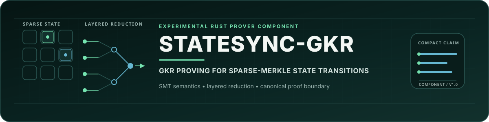
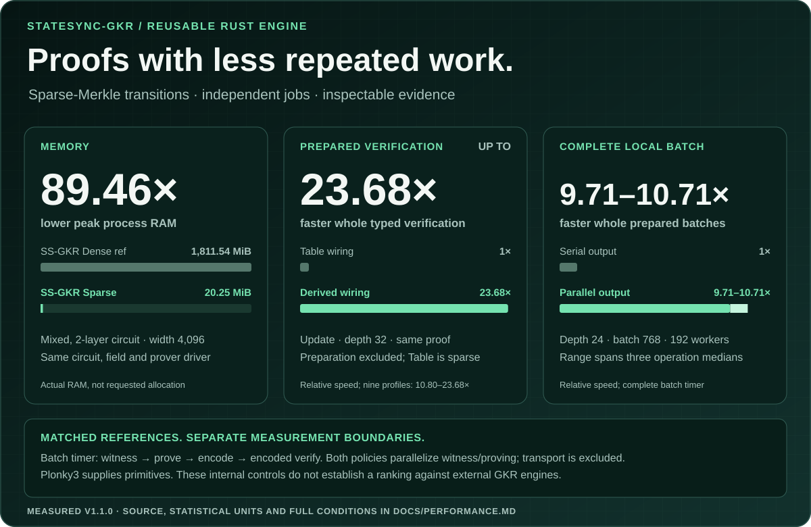
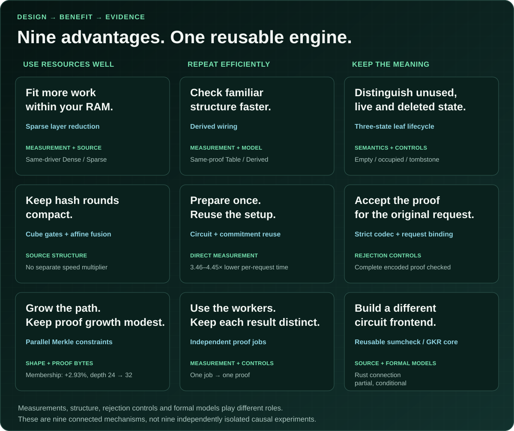
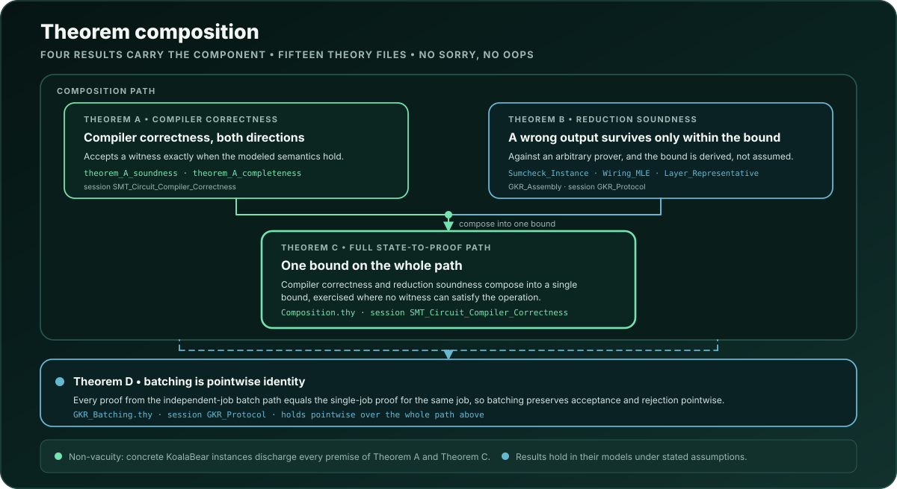

<p align="center">
  <picture>
    <source media="(max-width: 900px)" srcset="assets/brand/statesync-gkr-hero-mobile.svg">
    
  </picture>
</p>

<p align="center">
  <a href="https://github.com/Oraclizer/statesync-gkr/actions/workflows/ci.yml"></a>
  <a href="https://github.com/Oraclizer/statesync-gkr/actions/workflows/risc0-guest-identity.yml"></a>
  <a href="https://github.com/Oraclizer/statesync-gkr/actions/workflows/proofs.yml"></a>
  <a href="LICENSE"></a>
  <a href="Cargo.toml"></a>
  <a href="https://doi.org/10.5281/zenodo.23136384"></a>
  <a href="https://arxiv.org/abs/2610.05335"></a>
</p>

# StateSync-GKR

A Rust GKR and sumcheck engine, specialized for sparse-Merkle state transitions.

[Quick start](#quick-start) · [API guide](docs/usage.md) · [Measured profiles](docs/performance.md) · [Formal boundary](FORMAL_VERIFICATION.md)

Its SMT frontend proves membership, non-membership and single-leaf updates.
The compiler and protocol models are machine-checked in Isabelle/HOL, with
a partial, conditional connection to the Rust implementation.

Prepare a circuit once, reuse its proving and verification material, and run
independent CPU proving jobs in parallel. The protocol and sumcheck crates
have no dependency on the SMT compiler, so other arithmetic-circuit frontends
can build on the same engine.

> **WARNING:** This is a research project. It has not been audited and may
> contain bugs and security flaws. This implementation is NOT ready for
> production use.

## Implementation benefits

<p align="center">
  <picture>
    <source media="(max-width: 900px)" srcset="assets/brand/statesync-gkr-performance-overview-mobile.svg">
    
  </picture>
</p>

<p align="center">
  <picture>
    <source media="(max-width: 900px)" srcset="assets/brand/statesync-gkr-benefits-map-mobile.svg">
    
  </picture>
</p>

- **Use resources well:** sparse reduction, cube/affine fusion and parallel Merkle constraints.
- **Repeat efficiently:** derived wiring, prepared reuse and independent proof jobs.
- **Keep the meaning:** three-state lifecycle, strict codec/request binding and a reusable core with formal models.

[See the implementation](docs/architecture.md) · [Read the evidence conditions](benches/controlled-capacity-2026-10-07/FEATURES.md) · [Inspect the measurements](docs/performance.md)

Measurements, structure, controls and model results support different claims.
The nine mechanisms are not nine independently isolated causal experiments.

<details>
<summary>Measurement conditions and the full implementation map</summary>

The engine combines sparse proving, a compact circuit schedule and reusable
preparation. In separate controlled comparisons against its own references,
StateSync-GKR used **about 89 times less peak process RAM** and achieved
**up to 23.68 times faster prepared verification**.

| Mechanism | Application benefit |
|---|---|
| Two-phase sparse proving | More circuit or independent-job capacity within a RAM budget |
| Derived wiring | Less repeated work in the prepared verifier |
| Cube gates and affine fusion | A compact representation of Poseidon2 rounds |
| Parallel Merkle constraints | Modest proof-size growth across measured tree depths |
| Circuit, commitment and wiring reuse | Lower cost for repeated requests of the same kind and configuration |
| Independent proof jobs | Parallel CPU work with one result per original request |
| Empty, occupied and tombstone leaves | Distinct absence, insertion, update, deletion and restoration semantics |
| Strict encoding and request binding | Rejection of malformed or mismatched proof material |
| Reusable core and formal models | A separate sumcheck/GKR engine for other arithmetic frontends |

The RAM result is whole-process RSS for a two-layer mixed circuit of width
4,096: production Sparse versus this engine's test-only Dense reference.
The separate additional-requested-allocation ratio is 3,242.41, with matching
canonical proof observations. These two memory boundaries are not interchangeable.
The verification result times the complete prepared typed verifier call on the
same proof and request, changing only Table/Derived wiring; preparation is
excluded. Table is already sparse and is not the Dense prover reference.

Direct depth-24 fresh/prepared measurements show 3.46–4.45 times lower
per-request proving-path latency. Preparation reuses the circuit commitment
as well as compilation: one membership profile spends 105.03 ms on commitment
and 7.90 ms on compilation. The compact schedule has 118 layers across the nine
measured depth-24/28/32 profiles; membership proof bytes grow about 2.93% from
depth 24 to 32. Cube/affine fusion is a structural benefit without a separately
measured speed multiplier, and a cube gate is an IR operation, not a CPU instruction.

These mechanisms draw on measurements, source structure, rejection controls
and formal models, rather than nine independently isolated causal experiments.
The compiler-to-protocol model is mechanized; the Rust connection remains
partial and conditional. Licensing is described under [License and citation](#license-and-citation).

The [implementation architecture](docs/architecture.md) connects these mechanisms
to their source and application conditions. [Performance and operating
profiles](docs/performance.md) gives exact values, statistical units and the
separate memory, computation and serving measurements. These are engineering
observations about this artifact, not a comparison against every GKR engine.
The [controlled capacity replay](benches/controlled-capacity-2026-10-07/README.md)
provides the small Linux caller/memory check and the separate dataset layout.

</details>

## What you can use

- **SMT operation:** use `StateSyncProver` with `SyncRequest` for membership,
  absence or a single-leaf transition.
- **Prepared requests:** call `prepare` once for a kind and configuration,
  then `prove_sync_op_prepared` and `verify_sync_op_prepared` per request.
- **CPU jobs:** construct each witness with `make_job_prepared`, then run
  independent jobs through `prove_batch_parallel`.
- **Encoded proof:** use `encode_sync_result` and `verify_encoded_sync_op`.
- **Another circuit frontend:** use the `sumcheck` and `gkr` modules and supply
  the frontend's statement and input binding.
- **Model and implementation boundary:** read [Formal verification](FORMAL_VERIFICATION.md)
  and the [formal study](https://arxiv.org/abs/2610.05335).

For direct SMT checks and the GKR boundary, see [Choosing a path](#choosing-a-path).

## CPU measurements

Self-measured on two AMD EPYC 9R45 sockets: 192 physical CPU cores, SMT off,
384 GiB installed RAM, Linux, Rust 1.96.1 with `-Ctarget-cpu=native`.
Depth 24, batch 768, 192 workers, two-field occupied payloads:

All columns are inner proofs/s. The witness columns include proving; the last
column parallelizes witness creation in the benchmark caller.

| Operation | Proving only | Serial witness | Parallel witness |
|---|---:|---:|---:|
| Membership | 3,207.74 | 1,060.35 | 2,881.55 |
| Non-membership | 2,930.85 | 1,021.87 | 2,654.03 |
| Update | 2,092.03 | 594.56 | 1,984.00 |

Each value is the median of three process-level rates; each rate uses the
median of three measured batch intervals. The parallel-witness column is
benchmark-caller orchestration around the existing public APIs. Timers exclude
encoding, hash/control checks and delivery. Fixtures have independent roots;
these are inner-job rates, not sustained service throughput or sequential
state commits. The [controlled CPU note](benches/controlled-cpu-2026-10-06/README.md)
provides run ranges, latency, RSS, direct-SMT predicate scope, raw samples and replay.

A separate five-process supplement measures the broader computation interval:
parallel witness creation → proving → encoding → encoded-proof acceptance.
At the same depth 24, batch 768 and 192 workers:

Both columns are inner proofs/s for the complete prepared local computation.

| Operation | Parallel output | Serial output |
|---|---:|---:|
| Membership | 1,593.17 | 148.98 |
| Nonmembership | 1,431.66 | 144.01 |
| Update | 1,167.49 | 121.01 |

Both columns create witnesses and prove in parallel; only encoding and encoded
verification change mode. Paired serial/parallel timings of that full interval
yield 9.71–10.71 times lower local-batch time across the three operations. This
range summarizes paired ratios, not ratios of the throughput medians above.
Preparation, transport, post-timer hashing/logging and state commits are outside
this interval. These are computation rates, not service SPS. See the
[supplemental study](benches/controlled-cpu-2026-10-06-supplement/README.md) for
five-process ranges, direct preparation costs, paired wiring, input types and raw data.

## Measured serving and memory profiles

The later CPU experiments send complete encoded proofs over private TCP to a
separate 16-core generator/verifier. Their endpoint is cryptographic acceptance
of the original request, including queueing and transport.

- **48 cores / 96 GiB, 500 requests/s:** 450,000 timed requests over 15 minutes;
  every request accepted within 500 ms. p99 267.025 ms; maximum 307.096 ms.
- **Two 48-core / 96-GiB workers, 1,000 requests/s total:** each receives 500/s.
  Three 20-second process runs accepted every timed request within 500 ms;
  process p99 282.108–329.785 ms.
- **192 cores / 384 GiB, 1,000 requests/s:** three 60-second process runs
  accepted every timed request within one second; process p99 426.032–443.471 ms
  and 99.62–99.92% within 500 ms.
- **192 cores / 384 GiB, 1,150 requests/s:** one 60-second run accepted all
  69,000 timed requests within two seconds, with maximum latency 1,598.489 ms.
  Of those requests, 48,553 (70.3667%) met one second. Including the drain to
  final acceptance at 61.394 s, the finite-window rate was 1,123.89 accepted
  requests/s. The growing queue prevents a sustained 1,150/s capacity claim.

The mix is membership/non-membership/update 1:1:1 at depth 24. Worker count,
batch cap and maximum wait are 48/48/5 ms per 48-core worker, and 192/192/5 ms
on the 192-core VM. Repetitions use the same fixed corpus on each named host;
different hosts, periods and profiles are kept separate. The two-worker result
is a resource-equivalent deployment comparison against one 96-core worker with
batch cap 96, not a topology-only causal experiment. At 1,150/s, the one-second budget met
in short screens did not hold for all requests in the 60-second confirmation;
the two-second budget held for every request. Sixty seconds is the offered-load
window, not a prover lifetime limit. Queues, late acceptances and explicit
overload outcomes remain in the data.

Memory is measured independently on generic circuits. The same-driver Sparse
path succeeded through tested width 65,536 under a 3-GiB cgroup with swap
disabled, while the internal Dense reference reached a native OOM at width
8,192. This is a bounded tested scale, not the largest supported circuit.
Requested allocation, owned Vec capacity and whole-process RSS have separate
plots and definitions. The [profile guide](docs/performance.md) explains the
comparison and the [usage guide](docs/usage.md#choosing-worker-and-batch-settings)
shows how to apply the observed settings.

## Quick start

Use the current BSL-licensed source distribution for this local example.
Research, development and other non-production use are permitted by
[LICENSE](LICENSE). Pin a specific current commit when recording a replay.

```sh
git clone --depth 1 https://github.com/Oraclizer/statesync-gkr.git
cd statesync-gkr
rustup show
cargo run --release --locked --example state_sync_prove_verify
```

Expected output:

```text
honest-proof=PASS
tampered-proof=REJECTED
secondary-finalized=false
```

The example builds one synthetic membership request, proves it, verifies the
honest result and rejects a modified proof. It uses the pinned Rust toolchain
and the release lock file. The packages are distributed as source; pin a Git
tag or commit when integrating them into another application.

## Minimal Rust integration

The facade consumes an operation, its private Merkle witness and the public
inputs that the caller expects. A checked call handles both construction
errors and a rejected verifier result:

```rust
use statesync_gkr::{StateSyncProver, SyncRequest, SyncResult};

pub fn prove_checked(
    prover: &StateSyncProver,
    request: &SyncRequest,
) -> Result<SyncResult, String> {
    let result = prover
        .prove_sync_op(request)
        .map_err(|error| format!("proving failed: {error:?}"))?;
    if !prover.verify_sync_op(request, &result) {
        return Err("the proof or its request binding was rejected".to_owned());
    }
    Ok(result)
}
```

[Usage and API boundary](docs/usage.md) contains a complete application,
dependency pin, supported input format, prepared execution and error handling.
The caller obtains trusted roots and witnesses from its own state store; the
library does not authenticate an external database or establish consensus.

The current verifier reconstructs the circuit input from that witness,
including the leaf hash and the complete old/new Merkle paths.

## Choosing a path

If you only need to check a supplied sparse-Merkle authentication path, start
with `compiler::smt_valid_native`, the native operation-semantics checker.
That path does not create a GKR proof. Use the GKR layers when you need the
layered-circuit engine, the compiler-to-protocol model or the documented
external-proof integration. See [Choosing a path](docs/usage.md#choosing-a-path)
for the different inputs and costs.

The current SMT verifier still takes the private leaf and full sibling path
and recomputes their native Poseidon2 hashes before checking the GKR proof.
This frontend does not offload that Merkle hashing from the verifier.

## Reusable engine and SMT frontend

`ssgkr-sumcheck` implements multilinear sumcheck. `ssgkr-protocol` provides
the layered-circuit representation, weighted linear, multiplication and cube
gates, layer reduction and the GKR proof chain. These crates do not depend on
`ssgkr-compiler`.

The SMT frontend supplies operation semantics, the circuit compiler, witness
layout and the checks that bind a proof to an SMT request. Prepared execution
reuses the circuit, its commitment and derived wiring material; independent
jobs still produce one inner proof each.

The field, Poseidon2 and challenger primitives come from pinned Plonky3
crates. Rayon schedules CPU workers. The SMT compiler, GKR assembly,
sumcheck implementation, sparse wiring, preparation reuse and batch
orchestration are implemented in this repository.

The shipped GKR API uses KoalaBear circuit values and degree-four extension
challenges with Poseidon2. Other applications need their own frontend and
must check the residual input claims returned by the protocol verifier.
There is no bundled compiler for arbitrary Rust programs or a runtime
field/hash selection API.

## Architecture

<p align="center">
  <picture>
    <source media="(max-width: 900px)" srcset="assets/diagrams/architecture-overview-mobile.svg">
    
  </picture>
</p>

Eight crates own one concern each, and the dependency direction is a frozen
design boundary:

```text
ssgkr-primitives -> ssgkr-sumcheck -> ssgkr-protocol -> ssgkr-compiler
     -> {ssgkr-batching, ssgkr-commitment}
          -> {ssgkr-verification, ssgkr-wrap}
               -> statesync-gkr facade
```

The generic protocol crates never learn sparse-Merkle specifics, so
`ssgkr-sumcheck` and `ssgkr-protocol` are reusable on their own.
`ssgkr-primitives` is the only crate allowed to name a `p3-*` path, which
confines the pinned plonky3 dependency to one adapter.

The state-to-proof path runs from native operation semantics, through circuit
compilation and witness layout, through per-layer sumcheck, to a verifier
check that reduces to the input-layer claim. The transcript binds a domain
tag, circuit digest, public inputs, layer claims, and round messages in a
fixed order, so proof bytes cannot depend on worker count or scheduling.

Crate ownership, trust boundaries, the failure model, and the frozen
compatibility interfaces are described in
[ARCHITECTURE.md](ARCHITECTURE.md). The separation between the internal proof
and the external proof role is recorded in
[ADR-0002](docs/adr/0002-external-proof-role-contract.md).

## Model verification and implementation boundary

Compiler-model correctness assumes the stated hash-stack behavior; the
protocol's challenge assumptions are explicit.


The Isabelle development connects SMT operation semantics, compiler-model
acceptance and GKR assembly soundness, and mechanizes batching preservation
and the exact degree-four KoalaBear extension. Registered concrete instances
establish that the model assumptions can be satisfied.

The Rust connection consists of recorded contracts, tests and a conditional
acceptance-to-model result. Whole-program value correspondence, the executable
challenge distribution and the multi-round Fiat-Shamir security argument
remain outside the established result. The inner proof is not a zero-knowledge
proof. See [FORMAL_VERIFICATION.md](FORMAL_VERIFICATION.md) for the full
statement, assumptions and non-claims.

Primitive security, side channels, denial of service, deployed destination
behavior and operational safety are outside these claims.

<p align="center">
  <picture>
    <source media="(max-width: 900px)" srcset="assets/diagrams/theorem-composition-mobile.svg">
    
  </picture>
</p>

## External execution evidence

The frozen proof identity has also been exercised outside a single developer
machine, and the records ship in this tree:

- The published proof binds an exact RISC Zero program identity.
  [`spikes/zkvm-wrap/identity/`](spikes/zkvm-wrap/identity/) fixes the
  expected program record, and a public policy check rejects any undeclared
  change to it.
- A sealed receipt for the historical v1.1 program identity was checked through the zkVerify
  RISC0 pallet on the public Volta chain. The exact statement, aggregation
  coordinates, and resulting receipt tuple are recorded in
  [`release/v1.1/PUBLIC_INPUTS.json`](release/v1.1/PUBLIC_INPUTS.json) and
  [`release/v1.1/PROOF_MANIFEST.json`](release/v1.1/PROOF_MANIFEST.json). The
  previous line's submission stays frozen in
  [`tests/vectors/risc0-route-b-volta-2.0.0-runtime-rebind-v1.json`](tests/vectors/risc0-route-b-volta-2.0.0-runtime-rebind-v1.json)
  with its transcript, and the codec is specified in
  [`docs/encoding/risc0-route-b-manifest-v1.md`](docs/encoding/risc0-route-b-manifest-v1.md).
- Source reproduction is a first-class interface:
  [`release/v1.1/SOURCE_RECIPE.md`](release/v1.1/SOURCE_RECIPE.md) separates
  anonymous source reproduction, which any machine can run against the pinned
  toolchain and the documented deterministic proof digest, from recorded
  exact-identity reproduction, and
  [`release/v1.1/verify.py`](release/v1.1/verify.py) replays the recorded
  hashes.
- The exact v1.0 release artifacts were placed in AWS durable object storage
  under a version-bound retention lock and restored bit for bit in a separate
  project-operated custody check. The redacted public record of that check,
  including the restore result and what it does not claim, ships in
  [`release/v1.0/AWS_CUSTODY_RECEIPT.json`](release/v1.0/AWS_CUSTODY_RECEIPT.json).

## Proof-bound source

The historical external proof is bound to its recorded v1.1 program identity.
The current distribution preserves 78 of the 79 protected files byte for byte;
the root Cargo license field has the one explicitly checked metadata change.
The checker compares the current Cargo bytes and Git blob first, then uses an
in-memory projection solely to compare with the preserved historical baseline.
It does not assign that historical compiled identity to the current metadata.
Comments, diagnostics, package descriptions, canonical vectors and field order
remain checked. The exact difference and the incomplete compiled comparison
are recorded in [LICENSING_DISTRIBUTION.json](release/v1.1/LICENSING_DISTRIBUTION.json). The image
ID is `dc9a5f0da608178bbe56e98604cb895060c555c18329846b453f71d562d16530`; the
remaining content addresses are recorded in
[`release/v1.1/PROOF_MANIFEST.json`](release/v1.1/PROOF_MANIFEST.json). A
different build result is a different identity and is never adopted by editing
an expected hash. The frozen surface also retains a finite list of historical
source annotations, which are not current workflows, approvals, runtime
roles, or endorsements; every one of them is defined in
[docs/frozen-source-identifiers.md](docs/frozen-source-identifiers.md).

## Repository map

- `crates/` - primitives, sumcheck, protocol, compiler, batching, commitment,
  verification, and external-wrap owners;
- `src/` - public facade and developer binaries;
- `formal/isabelle/` - canonical Isabelle theory sources;
- `verif/` - Creusot and Why3 replay records;
- `tests/` - public vectors and positive and negative controls;
- `examples/` - runnable prove-and-verify and reference-transition paths;
- `spikes/zkvm-wrap/` - selected zkVM integration source and exact identity
  recipe, retained at its identity-bound path;
- `benches/` - development measurement reports; the harness itself is
  `src/bin/measure.rs`;
- `docs/` - architecture decisions, encodings, generated proof documents, and
  frozen identifier definitions;
- `release/v1.1/` - public surface verifier, source recipe, manifests, and
  release evidence;
- `release/v1.0/` - the frozen record of the previous identity cycle, kept
  byte for byte and never regenerated;


## Documentation

- [Architecture](ARCHITECTURE.md)
- [Formal verification](FORMAL_VERIFICATION.md)
- [GKR base-session document snapshot (2026-08-29)](docs/GKR_Protocol.pdf)
- [Compiler document snapshot (2026-08-29)](docs/SMT_Circuit_Compiler_Correctness.pdf)
- [Frozen source identifiers](docs/frozen-source-identifiers.md)
- [Inner proof encoding](docs/encoding/inner-proof-v1.md)
- [Route manifest encoding](docs/encoding/risc0-route-b-manifest-v1.md)
- [Destination policy encoding](docs/encoding/risc0-route-b-destination-policy-v1.md)
- [Receipt-gated local transition](docs/encoding/receipt-gated-local-transition-v1.md)
- [Usage and API boundary](docs/usage.md)
- [Development measurements](benches/README.md)
- [Troubleshooting](docs/troubleshooting.md)
- [Reproducing the release](REPRODUCING.md)
- [Release notes](release/v1.1/RELEASE_NOTES.md)
- [Release evidence](release/v1.1/README.md)
- [Source reproduction](release/v1.1/SOURCE_RECIPE.md)
- [Changelog](CHANGELOG.md)

## Companion work

The [Settlement EVM reference](https://github.com/Oraclizer/statesync-gkr-settlement-evm)
maintains destination receipt consumption and lifecycle authorities with its
own toolchain, tests, and release cadence. Its
[relationship and compatibility map](https://github.com/Oraclizer/statesync-gkr-settlement-evm/blob/main/docs/REPOSITORY_RELATIONSHIP.md)
separates source compatibility from historical execution evidence. The V2
reference is unaudited and non-deployed; historical V1 addresses must remain
abandoned. This prover release contains proving and verification artifacts
and does not distribute destination contracts or claim a production deployment.

## Security, support, and contributing

Report suspected vulnerabilities privately through [SECURITY.md](SECURITY.md),
never in a public issue.

[CONTRIBUTING.md](CONTRIBUTING.md) describes the contributions that help most
and exactly which checks a pull request must pass.
[SUPPORT.md](SUPPORT.md) describes what help is available and how triage
works. [GOVERNANCE.md](GOVERNANCE.md) describes how decisions are made. This
is a research project with best-effort maintenance; there is no bounty and no
production support programme.

## Acknowledgments

We thank Bernhard Müller ([@muellerberndt](https://github.com/muellerberndt)) for his independent review of the verifier's challenge-generation assumptions and the implementation-facing interpretation of the extension-field soundness bound. His analysis clarified the distinction between the mechanized field/model results and the remaining multi-round Fiat–Shamir and input-binding arguments, and informed the corresponding claim corrections. The project maintainer remains responsible for the implementation and the remaining security arguments.

[Contributor and review history](CONTRIBUTORS.md) records the original authorship and the scope of this review.

## License and citation

From 2026-10-09 the maintained branch and every version after v1.1.0 are
licensed under the [Business Source License 1.1](LICENSE). Research,
development, evaluation, auditing, benchmarking and other non-production use
are free, and production use solely to verify proofs is granted. Production
use that generates proofs, embeds or redistributes proving functionality in a
product or service, or offers proof generation to third parties requires a
commercial license from
Oraclizer Labs, Inc.; see [oraclizer.io](https://oraclizer.io) for the
licensing contact. Each version converts to Apache-2.0 three years after its
first public distribution. The Business Source License is source-available
and is not an Open Source license in the OSI sense.

Earlier copies through v1.1.0 were distributed under Apache-2.0 or MIT.
Rights already granted to their recipients remain valid. The maintained
repository and its current official distribution use BSL-1.1; the former
source history is preserved separately and is not an alternative public
download route. [NOTICE](NOTICE) retains the required contribution and
third-party notices.

[CITATION.cff](CITATION.cff) describes the current v1.1.1 licensing revision.
The earlier software record, [DOI 10.5281/zenodo.23136385](https://doi.org/10.5281/zenodo.23136385),
identifies the historical v1.1.0 artifact. The current v1.1.1 software record is
[DOI 10.5281/zenodo.23280552](https://doi.org/10.5281/zenodo.23280552). See
[reproduction guidance](REPRODUCING.md) for current source checks and the
scope of historical proof evidence.

The companion paper, *StateSync-GKR: Machine-Checking the Trust Chain from
Sparse-Merkle State Transitions to GKR Verification*, is available as
[arXiv:2610.05335](https://arxiv.org/abs/2610.05335). The paper uses the
arXiv non-exclusive distribution license. This identifier names the formal
study, not the separate engineering evaluation. The engineering manuscript and
its new dataset are prepared for review; no new arXiv identifier, dataset DOI
or public download URL is assigned here. The current state is recorded in the
[dataset locator](benches/controlled-capacity-2026-10-07/DATASET_LOCATOR.json).
