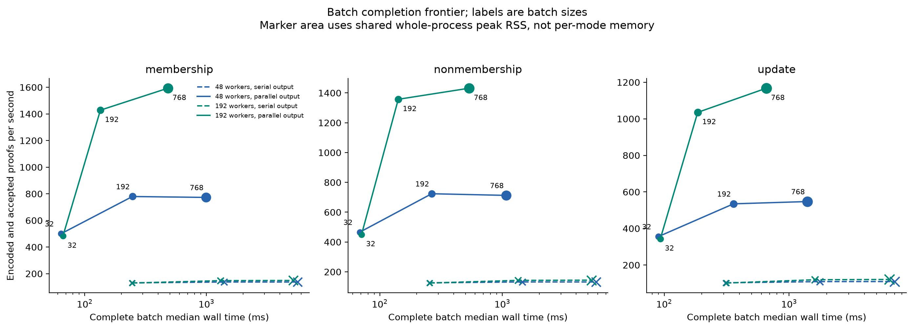
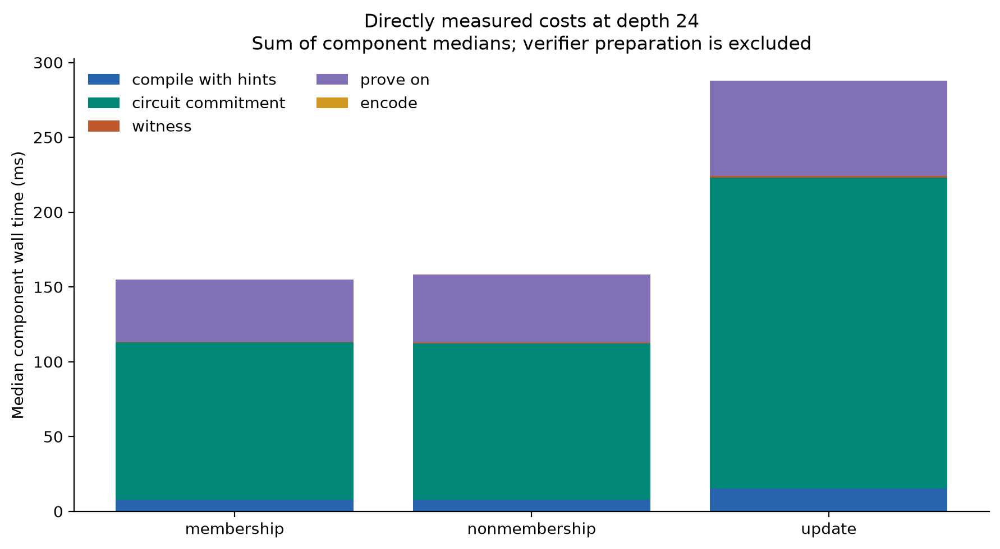
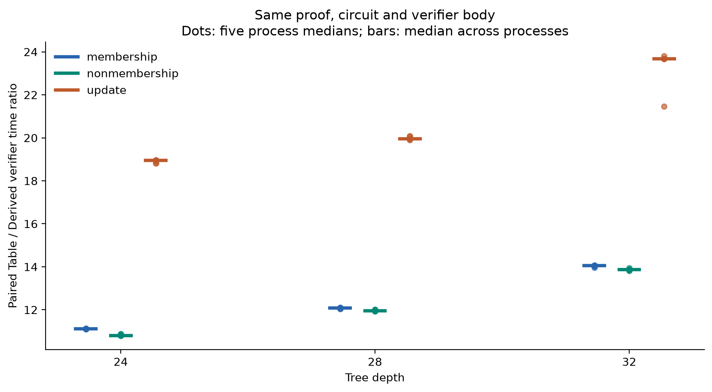
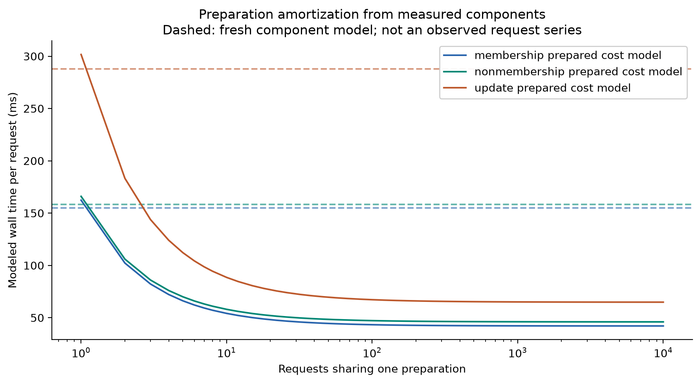
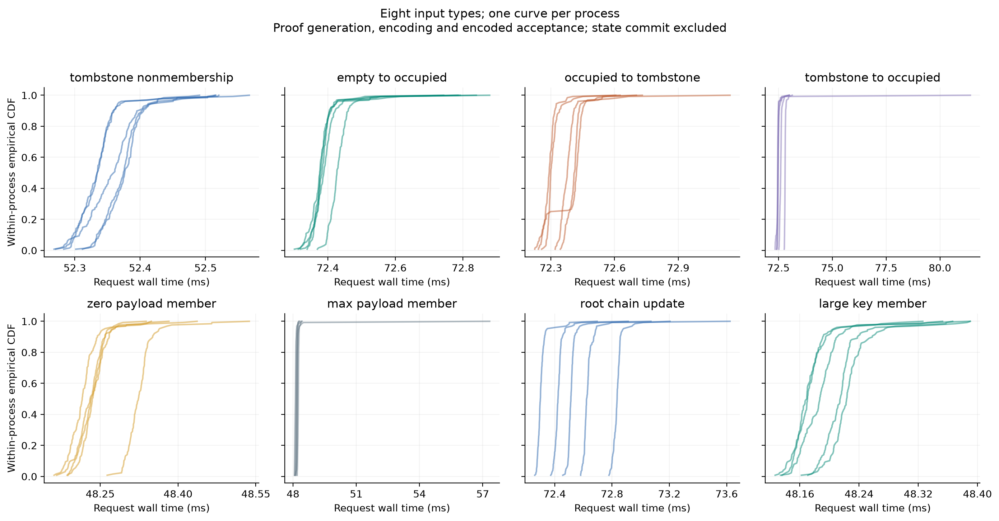
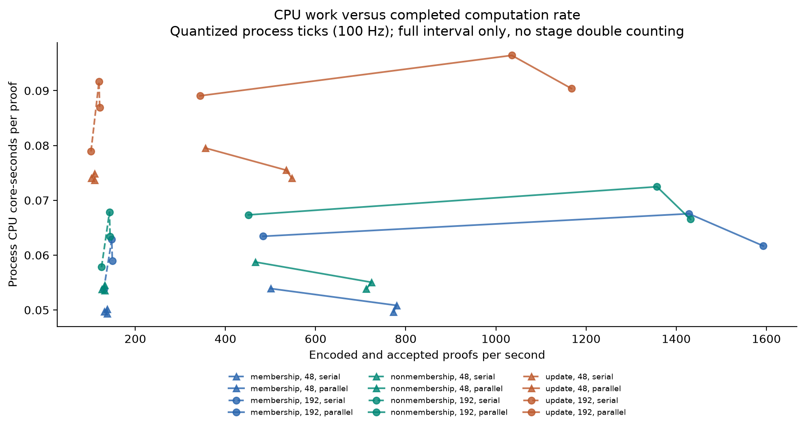
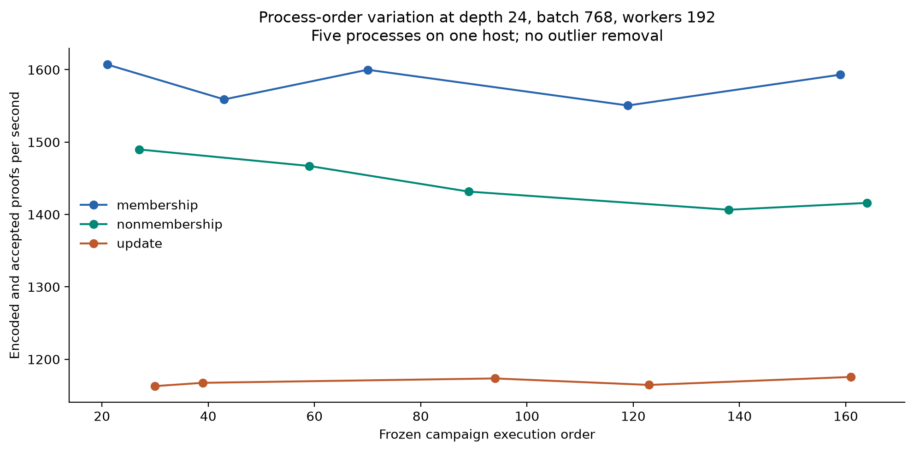
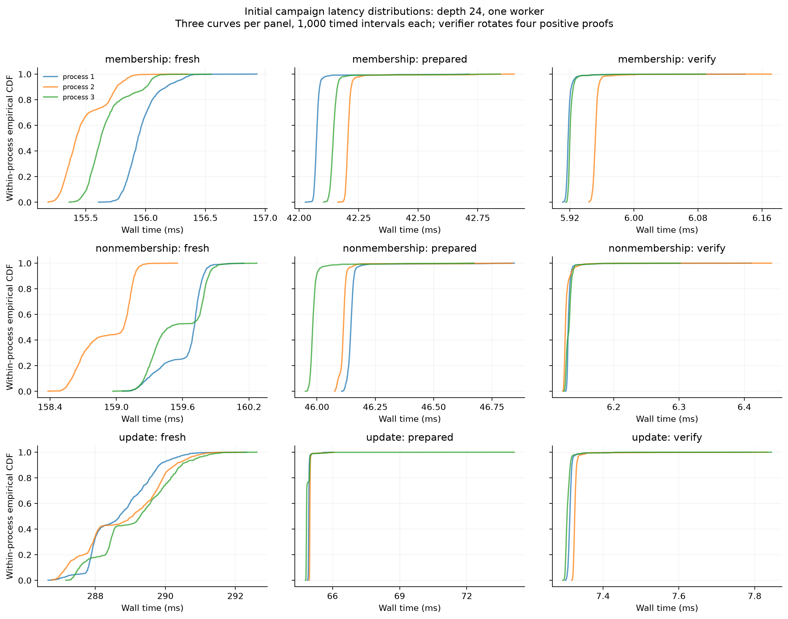

# Supplemental CPU computation study (2026-10-06)

This self-measured study adds directly timed component calls, paired verifier
wiring, encoded-proof acceptance and eight input types to the
[original study](../controlled-cpu-2026-10-06/README.md). It consumes the unchanged
signed `v1.1.0` source, not a new protocol or production synchronization service.

## Witness to encoded-proof acceptance

Depth 24, batch 768, 192 CPU workers, two-field occupied payloads. Both modes
create witnesses and prove in parallel; only encoding and encoded verification
change between serial and parallel output processing.

Column definitions:

- **Parallel output:** Parallel output processing (encoded-accepted inner proofs/s)
- **Serial output:** Serial output processing (encoded-accepted inner proofs/s)

| Operation | Parallel output | Serial output |
|---|---:|---:|
| Membership | 1,593.17 [1,550.60, 1,607.14] | 148.98 |
| Nonmembership | 1,431.66 [1,406.55, 1,489.84] | 144.01 |
| Update | 1,167.49 [1,162.97, 1,175.61] | 121.01 |

Each process rate is `768 / median(10 actual complete-pipeline seconds)` after
one warmup batch. The headline is the median of five process rates; brackets
show their observed range. These five processes share one server and the same
fixture corpus. They are not five machines or independently generated inputs.

The actual interval includes parallel witness construction, inner proving,
encoding, encoded verification, phase tick probes, result assembly and temporary
jobs/proofs/verdict cleanup. Canonical SHA comparison, negative controls, returned
encoded-buffer drops, data writing and delivery remain outside. There is no
overlap among these stages, state-store lookup, queue/network measurement or
completed bidirectional synchronization SPS claim. The [original proof-only
3,207.74/2,930.85/2,092.03 rates](../controlled-cpu-2026-10-06/README.md) retain
their original denominator and are not replaced by these broader intervals.



Batch sizes 32/192/768 and 48/192 workers: five-process medians of actual
witness-to-encoded-acceptance rates, with the two output modes separate.
Process ranges are retained in the table and cohorts.

## Direct costs and paired wiring

Suite A directly calls the released compiler, wiring derivation, circuit
commitment, witness generator, prover, encoder and common verifier. The public
preparation used for encoding is created separately and recorded outside these
direct timers. `compile_with_hints` includes its existing layout hints.

Representative membership, depth 24: medians of five run-specific request p50s,
300 measured requests and five warmups per process.

| Direct call | p50 (ms) |
|---|---:|
| Compile with hints | 7.9021 |
| Derive verifier wiring | 4.4190 |
| Circuit commitment | 105.0273 |
| Witness generation | 0.5544 |
| Prove on circuit | 41.5387 |
| Encode | 0.0864 |
| Derived verifier | 5.8663 |
| Table verifier | 65.1941 |



Sum of component medians; individual process values are retained in cohorts.
Commitment construction is directly
measured, rather than assigned to an unexplained residual. These direct API
calls are not an independently measured fresh end-to-end interval.

The Derived and Table oracle calls use the same circuit, request, proof,
commitment and verifier body, with randomized call order. Across the nine
kind/depth configurations, the median-of-five process-level paired
Table/Derived time ratios range from 10.8000 to 23.6757. This is a comparison of
two wiring evaluators in this implementation, not competing prover products.



Each process first summarizes its same-sample Table/Derived ratios; the chart
then displays each of the five process representatives as a point and their
median as a horizontal line. Input, proof and circuit hashes bind both calls
to the same case.

## Preparation cost model



This is a derived cost model, not another batch experiment. The fresh
component model sums compile-with-hints, circuit commitment, witness and
prove-on p50 values. The reused-request curve amortizes separately observed
public preparation over a chosen reuse count, then adds witness and prove-on
cost. These assumptions exclude encoding and verification, and do not claim
that verifier wiring derivation is a separately additive prover stage. It does not
measure an application ROI, sustained latency, state commits or service SPS.
The exact model inputs and process values are in [cohorts.json](cohorts.json).

## Input types, CPU work and variation

Suite C adds tombstone non-membership; empty-to-occupied,
occupied-to-tombstone and tombstone-to-occupied updates; zero-field and
21-field occupied payloads; a large-key range within 24 bits; and a root-linked
update sequence on one key/path. Each configuration has 128 measured requests
and five warmups per process. A zero-field occupied payload is still distinct
from an empty leaf. Every root-chain predecessor and leaf/path relationship is
checked; this is not a persistent or distributed commit workload.



Separate process distributions for the eight input types. Warmups are retained
in the raw files and excluded from these plotted measurements.



Process user/system ticks are quantized observations at the recorded CLK_TCK,
not nanosecond CPU timers. Nested complete intervals overlap stage observations
and must not be summed. Whole-process GNU time gives user/system seconds and
peak RSS; both B output modes share that one peak. It cannot be attributed
independently to the serial or parallel mode.



Raw process order and five-repeat variation are preserved, including slower
observations. Order seeds change execution order only; fixture generator/base
and variant seeds are separately recorded.



This last figure belongs to the separate original 243-process campaign and its
1,000-request distributions. It does not add observations to this supplement.

## Separate whole-process counter diagnostics

Four short diagnostic processes recorded the following counters with 100% event
running time. They are separate prefixes, not members of the primary 175-cell
sample. Hardware `:u` events observe user space; migration and page-fault events
are software counters.

| Diagnostic process | cycles:u | instructions:u | cache-misses:u | CPU migrations | Page faults |
|---|---:|---:|---:|---:|---:|
| A membership d24, workers 1 | 4,851,506,048 | 10,925,974,814 | 1,195,955 | 0 | 7,613 |
| A update d32, workers 1 | 12,055,291,288 | 26,821,727,466 | 3,527,050 | 0 | 30,070 |
| B membership d24, workers 48 | 677,565,213,724 | 1,676,476,248,816 | 72,870,250 | 70 | 490,652 |
| B membership d24, workers 192 | 699,845,130,887 | 1,680,444,924,012 | 551,851,351 | 978 | 980,162 |

These cover preparation, correctness checks, warmups, both B output modes,
canonical hashing and file I/O over the entire process. They do not attribute
counters to one phase/output mode or establish the cause of the primary-study
performance difference. [perf-diagnostics.json](perf-diagnostics.json) preserves
the values, event-running duration, source/binary/script hashes and scope.

## Source, data and replay

The host profile was two AMD EPYC 9R45 sockets, 192 physical/logical CPUs with
SMT off, two NUMA nodes and 384 GiB installed memory. Rust 1.96.1 / LLVM 22.1.2
used `-Ctarget-cpu=native`. CPU-set, observed clock policy, visible memory and
kernel data are preserved in [provenance.json](provenance.json); fixed frequency
or individual thread placement is not asserted. The full source audit compared
all 577 released files with the immutable source commit.

[plan.json](plan.json) describes 35 configurations x five independent processes,
[measurements.json](measurements.json) retains 175 process summaries and all
160,025 raw phase rows in lossless gzip CSV, and [cohorts.json](cohorts.json)
retains the 35 five-process aggregations. The rows include 156,100 measured and
3,925 warmup observations. All 654,720 B per-fixture byte records are retained
in compressed JSONL, and complete synthetic fixtures are deduplicated by their
original digest. Circuit layouts, grouping/sparse counts, preparation time,
canonical hashes, timestamps and GNU time records remain available.
Operational commands, credentials, account/address data and private paths are
excluded. Worker counts are expanded in public record labels; original artifact
digests bind the unmodified recordings.

Supplement quantiles use type7 linear interpolation at `(n-1)*q`; p50 equals
the ordinary sample median. p99 remains a descriptive sample statistic, not
stable tail inference from 300/128 requests or ten batches. Process distributions
are not pooled into independent-machine confidence intervals. The initial
campaign's floor quantile convention remains unchanged.

Recalculate the compressed public data without compiling or proving:

```sh
python3 data.py check-package .
```

Use [run.sh](run.sh) for a separately labeled small smoke or the frozen full
matrix on a dedicated Linux host. It stages the immutable release archive
(SHA-256 `d22e2200378e21a40c254eab8df4d44dfea81f2806f02f0c9030636300d489e9`),
checks the measured driver/lock, and uses existing controls from the original
public study. Prerequisites are Linux, Python 3.11+, Rust 1.96.1, normal Rust
build tools, GNU time, lscpu, taskset and tar. Full mode requires 192 available
physical/logical CPUs, no SMT, AVX-512 capability and 360+ GiB visible memory
to match the recorded 384 GiB host profile; that memory check is not an engine
minimum-RAM requirement. Replay results retain their caller-host label rather
than claiming the original physical machine.

```sh
bash run.sh --mode smoke --output cpu-supplement-smoke
# The dedicated full matrix is separately labeled and takes hours:
bash run.sh --mode full --output cpu-supplement-full
```

 The measured [fixture constructor](driver/src/fixture.rs) is retained byte for
byte, including its one trailing blank line (SHA-256
`4662fe5c0e2afee1cdf89abd9d206e5ccb5e6e6ca59e2cd36894953798bec971`).
Packaging does not reformat measured driver inputs.

The generic replay wrapper is reviewed/syntax-checked; the
completed campaign was not rerun during publication packaging.

The GKR verifier still takes the full Merkle witness and recomputes its native
hash paths; direct SMT predicates and full GKR verification are different work.
The recorded external vendor route remains fixed N=1 depth-24 membership.
No source/runtime/formal, guest ABI, proof identity, tagged Release or DOI was
changed. This remains unaudited research software.
