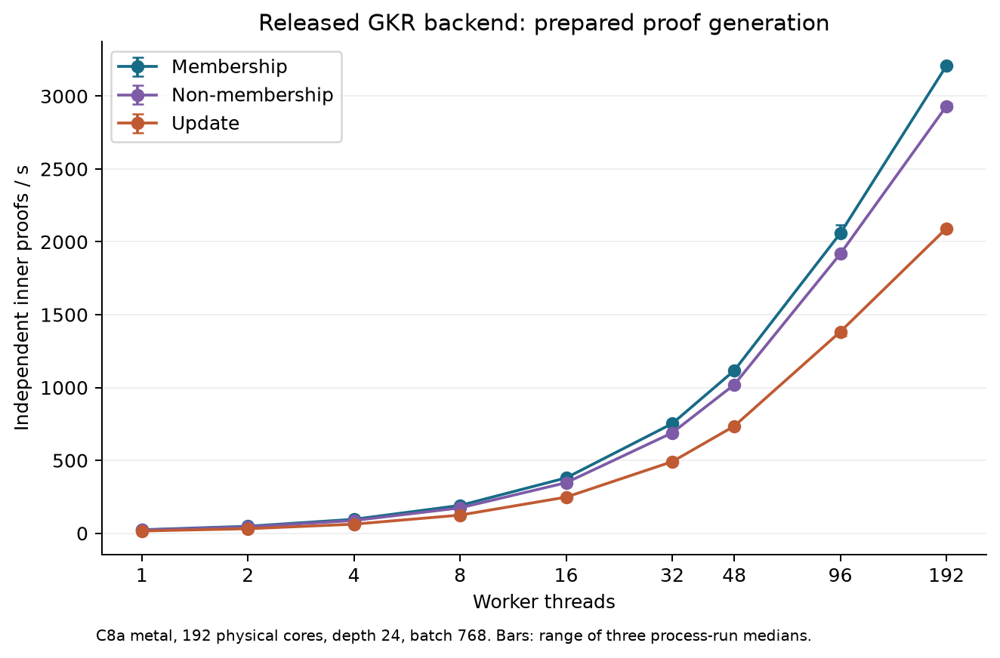
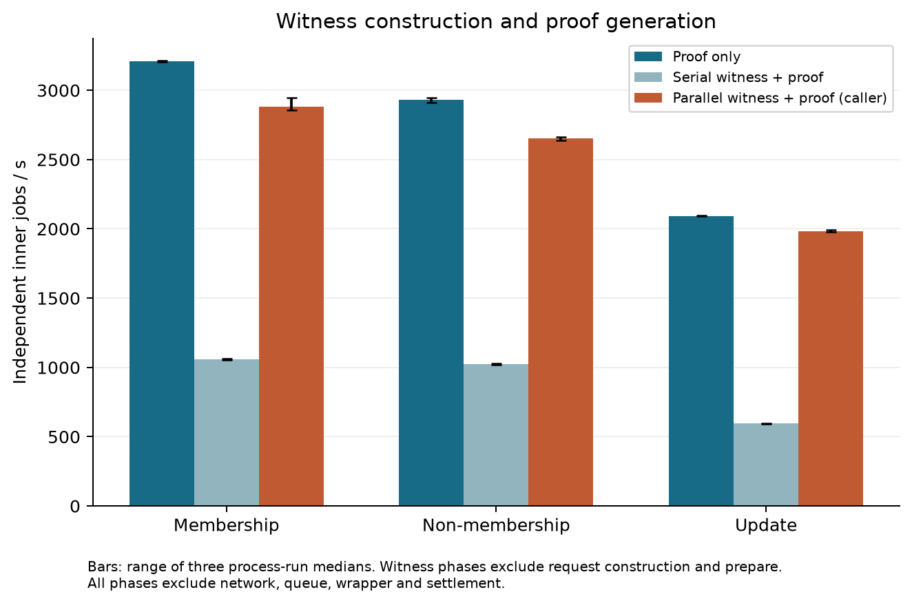
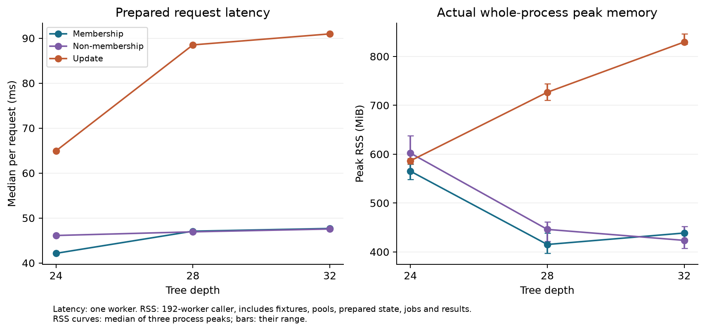

# Controlled CPU workload and replay (2026-10-06)

This technical note reports a controlled, self-measured CPU study and its
fixed workload and replay interface. It measures independent inner GKR jobs on the unchanged signed
`v1.1.0` source, not a completed state-synchronization service.

## Recorded results

The host had two AMD EPYC 9R45 96-Core Processor sockets, 192 physical/logical
CPUs with SMT off, two NUMA nodes and 384 GiB installed RAM (375.95 GiB visible
to Linux). The allowed CPU set was 0-191. Linux kernel 6.8.0-1066-aws,
Rust 1.96.1 / LLVM 22.1.2, native CPU compilation and the release dependency
lock were used. The performance governor and boost were observed; clock
frequency, individual worker placement and background load were not pinned.
The hardware reference is [reference-environment.json](reference-environment.json).

Depth 24, batch 768, 192 workers. Values are medians of three process-level
rates; a process rate is `768 / median(batch seconds)` over three measured
batches. Brackets contain the minimum and maximum process rate, not a
confidence interval or independent-machine replication.

Column definitions:

- **Prepared:** Prepared jobs, proving only (inner proofs/s)
- **Serial witness:** Serial witness + proving (inner proofs/s)
- **Parallel witness:** Caller parallel witness + proving (inner proofs/s)

| Operation | Prepared | Serial witness | Parallel witness |
|---|---:|---:|---:|
| Membership | 3,207.74 [3,202.66, 3,212.85] | 1,060.35 | 2,881.55 |
| Non-membership | 2,930.85 [2,911.49, 2,948.05] | 1,021.87 | 2,654.03 |
| Update | 2,092.03 [2,089.42, 2,094.47] | 594.56 | 1,984.00 |

For membership proving only, 1/48/96/192 workers produced 24.01/1,116.71/
2,058.71/3,207.74 inner proofs/s under the same batch-size convention.

At depth 24, the columns report:

- **Fresh:** Fresh request p50 (ms)
- **Prepared:** Prepared request p50 (ms)
- **Verification:** Prepared verification p50 (ms)
- **Caller RSS:** Parallel-witness caller maximum process RSS (MiB)

| Operation | Fresh | Prepared | Verification | Caller RSS |
|---|---:|---:|---:|---:|
| Membership | 155.6257 | 42.1431 | 5.9201 | 579.61 |
| Non-membership | 159.4804 | 46.1136 | 6.1304 | 638.17 |
| Update | 289.0572 | 64.9369 | 7.3125 | 589.01 |

Latency entries are medians of the three run-specific p50 values, each from
1,000 request samples after five warmups. A run quantile uses the sorted sample
at index `floor((N-1)*q)`; samples from different processes are not pooled.
RSS entries are the maximum whole-process peak across three repeats, including
untimed initialization and result/control storage. The memory plot below uses
the median and range of those process peaks rather than that maximum.



Prepared-job proving at depth 24, batch 768: median and range of the three
process rates for each worker count. The sequential baseline times the same
prepared proving work; it excludes witness generation.



The three timing paths at depth 24, batch 768, 192 workers. Caller witness
construction is either serial or parallel; collection completes before proving.



Prepared-request and verifier latency as depth changes, plus caller process
memory. Every plotted center and range comes from the three process summaries.
PNG copies are available in [figures/](figures/).

## Public numerical evidence

[measurements.json](measurements.json) contains all 243 process keys, setup
times, run-specific quantiles, process RSS/exits, start/end timestamps, all
sanitized GNU time metrics and source-CSV digests.
[samples.csv](samples.csv) contains all 63,540 raw elapsed-nanosecond samples,
with cell IDs pointing into that summary. [control-hashes.csv](control-hashes.csv)
records the 9 cases x 768 accepted fixture envelopes and their encoded byte
sizes; [topology-probes.json](topology-probes.json) retains the six separate
first-socket observations, including all 18 raw batch times;
[control-summary.json](control-summary.json) records their native/portable
hash and representative-byte checks. [provenance.json](provenance.json) preserves
the immutable source, measured driver/lock/binary hashes, unchanged-input
checks, original bundle hashes, and compiled developer-example result.
Provider account data, host addresses, absolute paths and operational logs are
excluded. These files repackage the completed original campaign; the generic
Linux runner below was syntax-checked and reviewed, not used to rerun it.

Recalculate the published sample statistics without compiling or proving:

```sh
python3 summarize.py check-published .
```

The numerical check validates sample hashes, exact cell keys/counts/order and
the run statistics. It does not independently authenticate a measurement host
or turn the recorded execution observations into a formal theorem.

## Source and caller

The runner downloads the immutable
[source archive](https://github.com/Oraclizer/statesync-gkr/releases/download/v1.1.0/statesync-gkr-v1.1-source.tar.gz)
and requires SHA-256
`d22e2200378e21a40c254eab8df4d44dfea81f2806f02f0c9030636300d489e9`.
It stages that source beside the standalone driver, retaining the measured
`../source` path dependency and checking shared package versions, sources and
checksums against the release lock.

The measured driver is [driver/src/main.rs](driver/src/main.rs), SHA-256
`b2d5a631e8527bca90d22065ca3692da48863f236f306d5217e8e4528fa1c75c`.
The released library, field/hash implementation, model sources, guest ABI and
external proof identity are unchanged. The caller's parallel witness creation
uses the public `make_job_prepared` API before `prove_batch_parallel`; it is
separate orchestration rather than a built-in witness-parallel facade method.

## Workload

- KoalaBear values, degree-four extension challenges, Poseidon2, strategy A;
- membership with an occupied leaf, non-membership with an empty leaf, and
  occupied-to-occupied update; occupied payloads contain two sync fields;
- deterministic distinct keys, identity bytes and siblings, with the key domain
  limited to 24 bits;
- each independent request computes its own root from its sibling path.

A batch is not one common global tree or a sequence of committed updates.
The workload measures reuse of one prepared circuit across independent jobs.
State-store witness lookup, sequential commits and complete bidirectional sync
are outside the measurement.

## Timing boundaries

| Phase | Timed work |
|---|---|
| fresh | Per-request compilation, witness generation and inner proving |
| prepared | Witness generation and inner proving on prepared material |
| verify | Prepared verification of four rotating positive proofs |
| seq-prove | Sequential proving of already-generated jobs |
| parallel | CPU parallel proving of already-generated jobs |
| stream | Serial witness collection, parallel proving and temporary job cleanup |
| stream-parallel-witness | Parallel witness collection, then parallel proving and temporary job cleanup |

Reusable preparation is recorded separately. Encoding, SHA checks, correctness
controls, proof delivery and final output cleanup are outside the timed
proving/caller intervals. These rates do not measure a sustained output stream
or service capacity. The two caller stages do not overlap. Batch time divided
by batch size is an amortized cost, not an individual parallel job's latency.
RSS is the whole-process maximum, including fixtures, prepared state, pools,
correctness initialization, jobs and returned proofs.

## Replay modes

Prerequisites: x86-64 Linux, Rust 1.96.1, Python 3.11+, normal Rust build tools,
GNU time, curl, sha256sum, tar, taskset and lscpu. Tools must already be installed.
The runner creates a new output directory and never overwrites an old study.

```sh
bash run.sh --mode smoke --output cpu-smoke
```

The default smoke uses four accepted/negative fixtures per kind/depth on both
portable and native builds, and three prepared timing calls per case. Its
status is `SMOKE_ONLY`, not a final capacity or published-profile result.

```sh
bash run.sh --mode full --output cpu-full
```

Full mode requires 192 available physical/logical CPUs without SMT, AVX-512
capability and 360+ GiB of observed memory to match the recorded 384 GiB host
profile. That memory condition is not the engine's minimum RAM requirement.
Use actual process RSS to evaluate resource use. A missing published hardware
reference or a CPU, kernel, NUMA or clock-policy difference remains
`OTHER_ENVIRONMENT`; matching metadata does not mean identical physical
hardware or identical background load.

The primary schedule contains 243 separate native process cells, three repeats
on one host and batch 768 across every kind. At depth 24 it measures fresh,
prepared and verify latency with 1,000 samples, sequential proving, pure proving
with 1/2/4/8/16/32/48/96/192 workers, and both caller modes with 96/192 workers.
At depths 28 and 32 it measures prepared/verify latency with 1,000 samples and the
three batch paths with 192 workers. Each batch process has one warmup batch and
three measured batches, totaling 2,304 measured proofs. First-socket observations
are separate auxiliary probes, not members of the primary 243-cell matrix.

The [stdlib analyzer](summarize.py) requires the complete cell-key set, no
missing/duplicate/out-of-order sample IDs, successful exits, actual RSS,
accepted native/portable control hashes, exact terminal status and recorded
input integrity. It keeps per-run quantiles separate and can export a compact
CSV with cell ID, sample index and raw elapsed nanoseconds. Partial input or a
changed denominator is not promoted to a completed replay.

## Choosing direct checking or GKR

For a supplied SMT path alone, `compiler::smt_valid_native` is the native
semantics checker. The GKR facade also checks a proof, transcript, residual
input claims and public-input binding. Its current verifier takes the private
leaf and complete Merkle witness and reconstructs the native old/new hash
paths. It does not eliminate Merkle hashing from that verifier.


For reference, the separately timed native predicate produced the following
request p50 values on the same host. Each entry is the median of three
process-specific p50 values, with 1,000 samples and five warmups per process.

| Depth | Membership (microseconds) | Non-membership (microseconds) | Update (microseconds) |
|---|---:|---:|---:|
| 24 | 19.380 | 19.380 | 38.831 |
| 28 | 22.180 | 22.030 | 44.310 |
| 32 | 24.990 | 24.841 | 49.651 |

This predicate does not construct or verify a GKR proof, transcript or encoding,
and does not perform the facade's complete public-input binding checks.
It is not an interchangeable verifier, so no GKR speedup/ranking follows.
The exact [native caller](native-predicate/driver/src/main.rs),
[27 process summaries](native-measurements.json) and
[27,000 raw samples](native-samples.csv) are supplied. Every process checked
768 honest fixtures and rejected changed old-root, new-root and sibling inputs
before timing. The independent fixture constructor follows the same fixed
seed, operation kinds, depths and two-field payload shape as the GKR study.

To run the separate predicate caller after a smoke/full runner has staged its
immutable source (replace `cpu-smoke` only with that output directory):

```sh
cp -R native-predicate cpu-smoke/native-predicate
RUSTFLAGS='-Ctarget-cpu=native' CARGO_TARGET_DIR="$PWD/cpu-smoke/build-native" \
  cargo +1.96.1 build --release --locked \
  --manifest-path cpu-smoke/native-predicate/driver/Cargo.toml
cpu-smoke/build-native/release/ssgkr-native-smt-baseline \
  --kind membership --depth 24 --run 1 > native-membership.csv
```

This single invocation is a functional measurement on the caller's own host,
not the published 27-cell repeat set or a service-capacity result.

The two paths have different work and outputs; their timings are not a
comparison of interchangeable verifiers. The layered engine, model
composition and documented external proof route are the additional GKR assets.
See [Choosing a path](../../docs/usage.md#choosing-a-path).

The recorded external vendor program is one fixed depth-24 membership example
checking a preserved inner proof. The general `wrap_relation` API is not a
claim that this program serves arbitrary requests. No new wrapper proof,
service SPS, deadline, security level or competitor-superiority claim is made.
